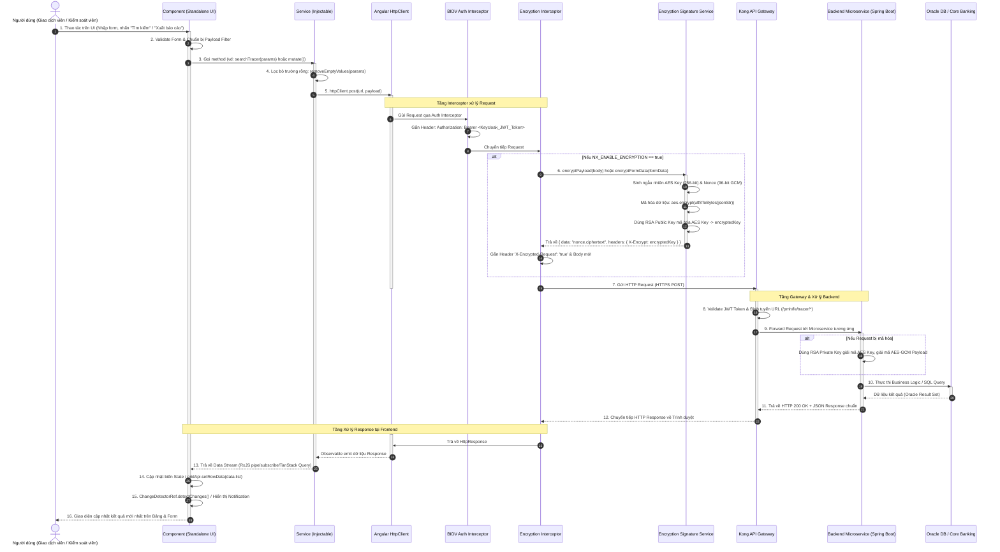
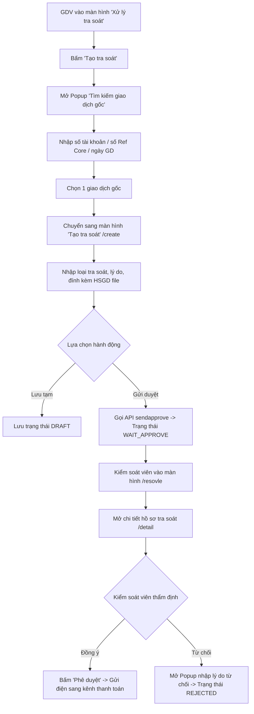

# TÀI LIỆU TOÀN DIỆN VỀ KIẾN TRÚC, LUỒNG HOẠT ĐỘNG VÀ GIẢI THÍCH MÃ NGUỒN FRONTEND (GWD-REPORT-FE)

> **Dự án:** `gwd-report-fe` (Payment Hub - Gateway Domestic & Report Frontend)  
> **Ngân hàng:** TMCP Đầu tư và Phát triển Việt Nam (BIDV)  
> **Hệ thống:** Cổng thanh toán tập trung (Payment Hub - PMH) / Phân hệ Tra soát & Báo cáo Gateway Trong Nước  
> **Tài liệu dành cho:** Developers, Tech Lead, Solution Architects, Tester & Onboarding Engineers.

---

## MỤC LỤC

1. [TỔNG QUAN HỆ THỐNG VÀ CÔNG NGHỆ SỬ DỤNG](#1-tổng-quan-hệ-thống-và-công-nghệ-sử-dụng)
   - 1.1. Mục tiêu dự án
   - 1.2. Tech Stack và lý do lựa chọn từng công nghệ
2. [KIẾN TRÚC TỔNG THỂ (MICRO FRONTEND VỚI NX & MODULE FEDERATION)](#2-kiến-trúc-tổng-thể-micro-frontend-với-nx--module-federation)
   - 2.1. Mô hình Host (Shell) & Remote App
   - 2.2. Cơ chế chia sẻ thư viện (Singleton Shared Libraries)
   - 2.3. Quản lý cấu hình Runtime & Môi trường (.env, Webpack DefinePlugin, runtime-env.ts)
3. [LUỒNG KHỞI ĐỘNG ỨNG DỤNG TỪ A - Z (BOOTSTRAP & INITIALIZATION LIFECYCLE)](#3-luồng-khởi-động-ứng-dụng-từ-a---z-bootstrap--initialization-lifecycle)
   - 3.1. Sơ đồ tuần tự khởi động (Bootstrapping Sequence Diagram)
   - 3.2. Thứ tự chạy chi tiết từ file đầu tiên đến khi render UI
   - 3.3. Cơ chế Xác thực Keycloak SSO & Phân quyền Menu IDM
4. [LUỒNG CHẠY CHI TIẾT CỦA API (END-TO-END API LIFECYCLE)](#4-luồng-chạy-chi-tiết-của-api-end-to-end-api-lifecycle)
   - 4.1. Sơ đồ tuần tự cuộc gọi API (Sequence Diagram)
   - 4.2. Chi tiết 8 giai đoạn từ User Action -> Network -> Render UI
   - 4.3. Cơ chế Bảo mật: Mã hóa lai AES-256-GCM + RSA 2048-bit Interceptor
5. [CẤU TRÚC THƯ MỤC VÀ CHI TIẾT TỪNG MODULE NGHIỆP VỤ](#5-cấu-trúc-thư-mục-và-chi-tiết-từng-module-nghiệp-vụ)
   - 5.1. Thư mục Host Shell (`host/`)
   - 5.2. Thư mục Remote App (`apps/pmh-gwd-report/`)
     - Cấu trúc `pages/` (8 phân hệ màn hình chức năng)
     - Cấu trúc `component/` & `BaseComponentTracer`
     - Cấu trúc `service/` (19 services gọi API)
     - Cấu trúc `guard/`, `directive/`, `pipes/`, `utils/`, `models/`
   - 5.3. Thư mục Shared Libs (`libs/`) & Quản lý State NgRx
   - 5.4. Scripts Build, Nginx & Docker Deployment
6. [GIẢI THÍCH CHI TIẾT TỪNG CLASS, HÀM, DÒNG CODE VÀ KHÁI NIỆM TRONG DỰ ÁN](#6-giải-thích-chi-tiết-từng-class-hàm-dòng-code-và-khái-niệm-trong-dự-án)
   - 6.1. `HttpClient` (`@angular/common/http`)
   - 6.2. `Kong API Gateway` (Cổng điều phối API)
   - 6.3. `inject()` (Dependency Injection hiện đại)
   - 6.4. `@bidv-api/angular`: `injectQuery()`, `injectMutation()`, `injectQueryClient()` (TanStack Query cho Angular)
   - 6.5. `removeEmptyValues()` (`utils/common.ts`)
   - 6.6. `ChangeDetectorRef` & `ChangeDetectionStrategy.OnPush`
   - 6.7. `ModuleFederationConfig`, `nxBidvShell`, `nxBidvRemote`
   - 6.8. `KeycloakAngularModule`, `importBidvAuthProviders`, `AuthGuard`
   - 6.9. Phân quyền nút bấm qua Directive `*bidvAuthHasPermission`
   - 6.10. `NgDompurifySanitizer` & `BIDV_SANITIZER` (Chống XSS)
   - 6.11. `EncryptionInterceptor` & `EncryptionSignatureService` (Mã hóa AES-GCM + RSA)
   - 6.12. `BaseComponentTracer.ts` (Lớp trừu tượng nền tảng)
   - 6.13. Router Guards & Cơ chế dọn dẹp Cache (`CanDeactivate`)
   - 6.14. Các toán tử RxJS trọng yếu (`takeUntil`, `BehaviorSubject`, `debounceTime`, `exhaustMap`, `switchMap`, `forkJoin`)
   - 6.15. `AG Grid Enterprise` (`AgGridModule`, `ColDef`, `GridReadyEvent`, `GridApi`)
   - 6.16. Webpack `DefinePlugin` & `runtime-env.ts`
   - 6.17. `TranslocoService` (Hệ thống đa ngôn ngữ)
7. [WALKTHROUGH: 3 LUỒNG NGHIỆP VỤ THỰC TẾ TRONG NGÂN HÀNG TỪ A - Z](#7-walkthrough-3-luồng-nghiệp-vụ-thực-tế-trong-ngân-hàng-từ-a---z)
   - 7.1. Luồng 1: Tạo và duyệt yêu cầu Tra soát giao dịch Realtime
   - 7.2. Luồng 2: Tiếp nhận và xử lý điện Trả lời tra soát (Reply Tracer)
   - 7.3. Luồng 3: Đối soát dữ liệu (Reconcile) và Xuất báo cáo Excel/PDF
8. [CƠ CHẾ TRUYỀN DỮ LIỆU & QUẢN LÝ STATE GIỮA CÁC MÀN HÌNH](#8-cơ-chế-truyền-dữ-liệu--quản-lý-state-giữa-các-màn-hình)
   - 8.1. Tại sao dùng `localStorage` thay vì NgRx cho dữ liệu nghiệp vụ Component?
   - 8.2. Chuyển đổi dữ liệu Date: `BidvDay` / `BidvDayRange` -> Chuẩn Date ISO/String
   - 8.3. Format tiền tệ (`Maskito`) và đọc tiền thành chữ (`money-reader.ts`)
9. [HƯỚNG DẪN TỪNG BƯỚC THÊM MỘT MÀN HÌNH CHỨC NĂNG MỚI (DEVELOPER PLAYBOOK)](#9-hướng-dẫn-từng-bước-thêm-một-màn-hình-chức-năng-mới-developer-playbook)
10. [TẠI SAO LẠI DÙNG? (DESIGN RATIONALE & ARCHITECTURAL DECISIONS)](#10-tại-sao-lại-dùng-design-rationale--architectural-decisions)
11. [BẢNG TRA CỨU ROUTING, SERVICE VÀ API ENDPOINT](#11-bảng-tra-cứu-routing-service-và-api-endpoint)

---

## 1. TỔNG QUAN HỆ THỐNG VÀ CÔNG NGHỆ SỬ DỤNG

### 1.1. Mục tiêu dự án
Dự án `gwd-report-fe` là giao diện người dùng chuyên biệt thuộc hệ thống **Payment Hub (PMH)** của BIDV, đảm nhận các chức năng nghiệp vụ trọng yếu:
- **Tra soát giao dịch trong nước (Domestic Tracer):** Xử lý khiếu nại, tra soát giao dịch thanh toán liên ngân hàng và nội bộ qua các kênh thanh toán (CITAD, NAPAS, Song phương, VCB, v.v.).
- **Xử lý điện tra soát Realtime & Non-Realtime:** Tạo yêu cầu tra soát, gửi duyệt, phê duyệt, từ chối, trả lời tra soát, tra soát hoàn tiền, thu phí, v.v.
- **Xử lý ngoại lệ (Exception Process):** Xử lý các giao dịch bất thường, timeout, lỗi hạch toán core banking.
- **Đối soát dữ liệu (Reconcile):** So khớp dữ liệu giữa Payment Hub với các kênh thanh toán, xuất báo cáo chênh lệch, gửi mail kết quả.
- **Báo cáo GWD (GWD Reports):** Thống kê điện đến, điện đi, luồng giao dịch nghi ngờ gian lận, báo cáo CTTN (Cổng thanh toán tập trung).

---

### 1.2. Tech Stack và lý do lựa chọn từng công nghệ

| Công nghệ / Thư viện | Phiên bản | Mục đích & Lý do lựa chọn |
| :--- | :--- | :--- |
| **Angular** | `16.2.12` | Framework frontend chuẩn của BIDV Enterprise. Hỗ trợ **Standalone Components**, tối ưu tree-shaking, hiệu năng cao với RxJS và hệ sinh thái dependency injection (DI) mạnh mẽ. |
| **Nx Workspace** | `18.1.3` | Nền tảng Monorepo giúp quản lý nhiều ứng dụng (`host`, `pmh-gwd-report`) và thư viện dùng chung (`libs/store`, `libs/utils`) trong một codebase duy nhất với bộ nhớ đệm build (Computation Caching) cực nhanh. |
| **Webpack Module Federation** | `5.x / @nx/webpack` | Giải pháp **Micro Frontend** chuẩn công nghiệp. Cho phép Host Shell nạp Remote App động tại runtime mà không cần build lại toàn bộ ứng dụng lớn khi chỉ có một module thay đổi. |
| **BIDV UI / Taiga UI CDK** | `1.1.6` / `@tinkoff/*` | Hệ thống Design System chuẩn hóa của BIDV (xây dựng dựa trên Taiga UI), cung cấp đầy đủ các control ngân hàng phức tạp: DateRange, Currency Mask, Maskito, Dialog, Hint, Alert, Sanitizer bảo mật (`ng-dompurify`). |
| **AG Grid (Enterprise)** | `1.0.6` / `ag-grid-community` | Grid dữ liệu hiệu năng cao dành cho các nghiệp vụ ngân hàng cần hiển thị hàng nghìn bản ghi tra soát với tính năng: Pinned column, pagination, filter, custom cell renderer, copy/paste mượt mà. |
| **Keycloak SSO (`keycloak-angular`)** | `14.4.0` / `25.0.0` | Giải pháp OpenID Connect (OIDC) / OAuth2 chuẩn bảo mật ngân hàng. Tự động kiểm tra phiên, cấp Bearer Token và refresh token ngầm khi gọi API. |
| **NgRx Store / Effects / Router-Store** | `~16.0.0` | Quản lý state toàn cục dự đoán được (Predictable State Container) theo mô hình Redux, xử lý side-effects bất đồng bộ và đồng bộ router state. |
| **@bidv-api/angular (TanStack Query)** | `^1.0.0` | Quản lý data fetching, caching thông minh, stale time, tự động refetch và tối ưu các thao tác mutate/query API. |
| **WebCrypto AES-256-GCM & RSA** | `@noble/ciphers` & `jsencrypt` | Cơ chế mã hóa E2E (End-to-End Encryption) từ trình duyệt đến API Gateway: Mã hóa Payload, Form-Data và Query Params bằng thuật toán lai (Hybrid Encryption). |
| **Transloco (`@jsverse/transloco`)** | `7.4.1` | Hệ thống đa ngôn ngữ (Tiếng Việt, Tiếng Anh, Tiếng Hàn) chuẩn ngân hàng. |
| **TailwindCSS & PostCSS** | `^3.0.2` | Tiện ích CSS utility-first giúp dàn layout linh hoạt, kết hợp SCSS tùy biến. |

---

## 2. KIẾN TRÚC TỔNG THỂ (MICRO FRONTEND VỚI NX & MODULE FEDERATION)

### 2.1. Mô hình Host (Shell) & Remote App

Dự án được phân tách thành 2 tầng rõ rệt:

```
+-----------------------------------------------------------------------------------------+
|                                    BROWSER CLIENT                                       |
|                                                                                         |
|   +---------------------------------------------------------------------------------+   |
|   |                            HOST APPLICATION (Shell)                             |   |
|   |  - Khởi động Keycloak SSO & Quản lý phiên đăng nhập                             |   |
|   |  - Cung cấp Layout khung của BIDV (Header, Navigation Menu, Sidebar, Footer)     |   |
|   |  - Cấu hình NgRx Root Store, HTTP Encryption Interceptor, Multi-language        |   |
|   +---------------------------------------+-----------------------------------------+   |
|                                           |                                             |
|                                           | Webpack Module Federation                   |
|                                           v (Lazy load bundle: remoteEntry.mjs)         |
|   +---------------------------------------------------------------------------------+   |
|   |                  REMOTE APPLICATION (apps/pmh-gwd-report)                       |   |
|   |  - Expose: './Routes' -> entry.routes.ts                                        |   |
|   |  - Chứa toàn bộ nghiệp vụ Tra soát (Tracer), Báo cáo (Report), Ngoại lệ, v.v.  |   |
|   |  - Standalone Components chạy bên trong <router-outlet> của Host Shell          |   |
|   +---------------------------------------------------------------------------------+   |
|                                           |                                             |
|                                           | Chia sẻ qua Shared Libraries:               |
|                                           | libs/store, libs/utils, @bidv-ui, @bidv-auth|
+-------------------------------------------|---------------------------------------------+
                                            |
                                            | HTTPS REST Request (Bearer JWT + AES/RSA)
                                            v
+-----------------------------------------------------------------------------------------+
|                             API GATEWAY (Kong API Gateway)                              |
|   - Prefix Routing:                                                                     |
|     • /pmh/fe/tracer/*      -> tracer-domestic-service                                  |
|     • /pmh/fe/gwd/*         -> gwd-report-service                                       |
|     • /pmh/fe/auth-service/* -> auth-service / IDM                                       |
|     • /pmh/tracer-inquiry/* -> tracer-inquiry-service                                   |
+-----------------------------------------------------------------------------------------+
```

1. **Host App (`host/`):**
   - Đóng vai trò là "Vỏ bọc" (Shell).
   - Chịu trách nhiệm xác thực người dùng qua Keycloak, lấy danh sách menu theo quyền (`getAppByUserUrl`, `getFunctionByUserUrl`).
   - Đăng ký các dịch vụ dùng chung: `EncryptionInterceptor`, `BIDV_SANITIZER`, `StoreDevtoolsModule`, đa ngôn ngữ `Transloco`.
   - Định tuyến Host (`host/src/app/app.routes.ts`) chỉ định khi truy cập URL `/tracer/tracer-domestic`, Webpack sẽ tự nạp bundle của remote app:
     ```typescript
     {
       path: 'tracer/tracer-domestic',
       canActivate: [AuthGuard],
       data: { appId: 'PMH2' },
       loadChildren: () => import('pmh-gwd-report/Routes').then((m) => m.remoteRoutes),
     }
     ```

2. **Remote App (`apps/pmh-gwd-report/`):**
   - Đóng vai trò là Micro Frontend độc lập chứa toàn bộ nghiệp vụ.
   - File cấu hình `module-federation.config.ts` của remote app xuất khẩu (expose) router:
     ```typescript
     export default nxBidvRemote({
       name: 'pmh-gwd-report',
       exposes: {
         './Routes': 'apps/pmh-gwd-report/src/app/remote-entry/entry.routes.ts',
       },
     });
     ```
   - Khi chạy ở môi trường Production, Host app tải file `remoteEntry.mjs` của `pmh-gwd-report` từ Nginx.

---

### 2.2. Cơ chế chia sẻ thư viện (Singleton Shared Libraries)

Để tránh tình trạng tải trùng lặp các thư viện nặng (Angular Core, NgRx, Keycloak, BIDV UI) nhiều lần giữa Host và Remote, root `module-federation.config.ts` thiết lập cơ chế **Singleton Shared Libraries**:

```typescript
// module-federation.config.ts
const coreLibraries = new Set([
  'jasmine-marbles', 'jest-preset-angular', 'keycloak-angular',
  'keycloak-js', '@jsverse/transloco', '@ngrx/store',
  '@ngrx/effects', '@ngrx/store-devtools'
]);

config.additionalShared = [
  { libraryName: '@ngrx/store', sharedConfig: { singleton: true, requiredVersion: '>=0.0.1' } },
  { libraryName: '@ngrx/effects', sharedConfig: { singleton: true, requiredVersion: '>=0.0.1' } },
  { libraryName: '@jsverse/transloco', sharedConfig: { singleton: true, requiredVersion: '>=0.0.1' } },
  { libraryName: '@bidv-auth/cdk', sharedConfig: { singleton: true, requiredVersion: '>=0.0.1' } },
  { libraryName: '@bidv-auth/layout', sharedConfig: { singleton: true, requiredVersion: '>=0.0.1' } },
  { libraryName: '@bidv-auth/router', sharedConfig: { singleton: true, requiredVersion: '>=0.0.1' } },
];
```
> **Tác dụng:** Đảm bảo toàn bộ ứng dụng chỉ có **1 phiên bản duy nhất (Singleton)** của NgRx Store, Keycloak Session, Router và Auth State trên toàn bộ vòng đời ứng dụng trong trình duyệt.

---

### 2.3. Quản lý cấu hình Runtime & Môi trường (.env, Webpack DefinePlugin, runtime-env.ts)

Hệ thống hỗ trợ 2 cơ chế đọc biến môi trường:
1. **Build-time:** Qua Webpack `DefinePlugin` lấy các biến có tiền tố `NX_*` từ file `.env`, `.env.sit`, `.env.uat`, `.env.production`.
2. **Runtime Configuration:** File `runtime-env.ts` hỗ trợ ghi đè biến cấu hình thông qua `window.__env__` (hỗ trợ Docker / Kubernetes ConfigMap mà không cần rebuild source code).

```typescript
// host/src/app/config/runtime-env.ts
export function getEnv(name: string, fallback?: string): string | undefined {
  const runtimeKey = name.startsWith('NX_') ? name.replace('NX_', '') : name;
  return runtimeEnv[runtimeKey] ?? buildEnv[name] ?? fallback;
}
```

Các biến môi trường trọng yếu:
- `NX_KEYCLOAK_URL`, `NX_KEYCLOAK_REALM`, `NX_KEYCLOAK_CLIENID`: Địa chỉ máy chủ Keycloak SSO.
- `NX_ENDPOINT_URL`, `NX_PMH_ENDPOINT`: Địa chỉ Kong API Gateway để gọi các REST microservices.
- `NX_ENABLE_ENCRYPTION`: Bật/Tắt tính năng mã hóa Payload qua Interceptor (`true`/`false`).
- `NX_GET_APP_BY_USER`, `NX_GET_FUNCTION_BY_USER`: API lấy danh sách quyền và chức năng menu của User đăng nhập.

---

## 3. LUỒNG KHỞI ĐỘNG ỨNG DỤNG TỪ A - Z (BOOTSTRAP & INITIALIZATION LIFECYCLE)

### 3.1. Sơ đồ tuần tự khởi động (Bootstrapping Sequence Diagram)

```
[Browser Load index.html]
         │
         ▼
[host/src/main.ts] ─────────────► import('./bootstrap') (Bảo vệ Module Federation)
         │
         ▼
[host/src/bootstrap.ts] ────────► platformBrowserDynamic().bootstrapModule(AppModule)
         │
         ▼
[host/src/app/app.module.ts]
         ├─► Khởi tạo NgRx StoreModule, EffectsModule, RouterStore
         ├─► Khởi tạo KeycloakAngularModule & importBidvAuthProviders
         ├─► Đăng ký EncryptionInterceptor vào HTTP_INTERCEPTORS
         └─► Đăng ký NgDompurifySanitizer vào BIDV_SANITIZER
         │
         ▼
[Keycloak OIDC Guard Check]
         ├─► Chưa đăng nhập ────► Redirect đến Keycloak Login Page
         └─► Đã đăng nhập   ────► Nhận Access Token, lưu vào Memory/Storage
         │
         ▼
[host/src/app/app.component.ts]
         ├─► Cấu hình LayoutFacade (Logo, Set App 'PMH2', Menu Prefix 'PMH_MENU')
         └─► Render template: <bidv-root> <bidv-ui-auth-layout> <router-outlet>
         │
         ▼
[host/src/app/app.routes.ts]
         ├─► AuthGuard kiểm tra quyền
         └─► Khớp URL: '/tracer/tracer-domestic'
         │
         ▼
[Webpack Module Federation Remote Loading]
         └─► Tải bundle 'pmh-gwd-report/Routes' -> apps/pmh-gwd-report/.../entry.routes.ts
         │
         ▼
[apps/pmh-gwd-report/.../entry.component.ts]
         └─► RemoteEntryComponent khởi tạo div container <router-outlet />
         │
         ▼
[apps/pmh-gwd-report/.../page.routes.ts]
         └─► Khớp path con (vd: 'resovle' -> CreateResovleTracerComponent)
         │
         ▼
[Component Lifecycle: ngOnInit()]
         ├─► Khởi tạo Reactive Form (FormGroup, Validators)
         ├─► Gọi Service lấy dữ liệu khởi tạo (Kênh thanh toán, Loại tra soát, v.v.)
         └─► Render bảng AG Grid & Giao diện chức năng
```

---

### 3.2. Thứ tự chạy chi tiết từ file đầu tiên đến khi render UI

1. **Bước 1: `index.html` -> `main.ts`**
   Trình duyệt tải `index.html`. File `main.ts` thực thi lệnh `import('./bootstrap')`. Việc bọc `bootstrap.ts` trong dynamic import cho phép Webpack kiểm tra các dependency chia sẻ (shared libraries) giữa Shell và Remote trước khi Angular khởi động.
2. **Bước 2: `bootstrap.ts`**
   Khởi chạy module chính của ứng dụng Shell: `platformBrowserDynamic().bootstrapModule(AppModule)`.
3. **Bước 3: `AppModule` cấu hình hệ sinh thái & Security**
   - Kích hoạt `KeycloakAngularModule` và cấu hình xác thực qua `importBidvAuthProviders`.
   - Khởi tạo `StoreModule.forRoot({})`, `EffectsModule.forRoot([])`.
   - Đăng ký `EncryptionInterceptor` vào danh sách `HTTP_INTERCEPTORS`.
   - Đăng ký `NgDompurifySanitizer` vào token `BIDV_SANITIZER` để làm sạch HTML an toàn.
4. **Bước 4: Xác thực người dùng (Keycloak OIDC)**
   - Nếu chưa có phiên đăng nhập, hệ thống tự động redirect sang trang đăng nhập Keycloak của ngân hàng.
   - Khi đăng nhập thành công, nhận JWT Access Token và gọi 2 API lấy phân quyền:
     - `NX_GET_APP_BY_USER`: Danh sách ứng dụng User được truy cập.
     - `NX_GET_FUNCTION_BY_USER`: Danh sách menu và quyền chi tiết của User.
5. **Bước 5: `AppComponent` (Host) khởi tạo Layout**
   - Thiết lập `LayoutFacade.setApp('PMH2')`, gán logo `assets/logo.png`.
   - Áp dụng bộ lọc menu: `layoutFacade.setCustomFilterMenu('PMH2', (funcs, role, user) => ...)`.
   - Template `<bidv-ui-auth-layout>` render Header, Sidebar, Dropdown chuyển đơn vị và chèn `<router-outlet>`.
6. **Bước 6: Routing nạp Remote App qua Module Federation**
   - URL `/tracer/tracer-domestic` khớp với `app.routes.ts`, kích hoạt nạp `pmh-gwd-report/Routes`.
   - File `apps/pmh-gwd-report/.../entry.routes.ts` được nạp, nạp tiếp `PageRoutes` từ `page.routes.ts`.
7. **Bước 7: Render Standalone Component tại trang nghiệp vụ**
   - Component nghiệp vụ (ví dụ `CreateResovleTracerComponent`) thực thi `ngOnInit()`: Khởi tạo form tìm kiếm, nạp danh mục kênh thanh toán, nạp danh sách tra soát vào bảng AG Grid.

---

## 4. LUỒNG CHẠY CHI TIẾT CỦA API (END-TO-END API LIFECYCLE)

### 4.1. Sơ đồ tuần tự cuộc gọi API (Sequence Diagram)



---

### 4.2. Chi tiết 8 giai đoạn từ User Action -> Network -> Render UI

1. **Giai đoạn 1: Tương tác người dùng tại Component**
   Người dùng click nút (Tìm kiếm, Tạo tra soát, Gửi duyệt, Hủy). Component kiểm tra tính hợp lệ của Form thông qua các custom validator từ `BaseComponentTracer`.
2. **Giai đoạn 2: Component gọi Service**
   Component gọi phương thức tương ứng trong Service.
3. **Giai đoạn 3: Làm sạch Payload (`removeEmptyValues`)**
   Hàm `removeEmptyValues(params)` đệ quy loại bỏ tất cả các field có giá trị `null`, `undefined`, chuỗi rỗng `""` trước khi gửi đi.
4. **Giai đoạn 4: Chuỗi Interceptor xác thực & bảo mật**
   - `BidvAuthInterceptor` gắn Header `Authorization: Bearer <Token>`.
   - `EncryptionInterceptor` (nếu `NX_ENABLE_ENCRYPTION=true`): Sinh khóa AES-256 ngẫu nhiên, mã hóa Body/Params bằng AES-GCM, mã hóa khóa AES bằng RSA Public Key, gắn Header `X-Encrypt` và `X-Encrypted-Request: true`.
5. **Giai đoạn 5: Kong API Gateway tiếp nhận & định tuyến**
   Kong Gateway phân giải tiền tố URL (`/pmh/fe/tracer/*`, `/pmh/fe/gwd/*`) để chuyển tiếp Request vào đúng Microservice Backend.
6. **Giai đoạn 6: Backend Microservice xử lý**
   Backend Spring Boot giải mã dữ liệu (nếu có mã hóa), kiểm tra phân quyền, thực thi truy vấn Oracle DB / Core Banking, đóng gói Response theo định dạng chuẩn `{ code: "00", message: "Thành công", data: {...} }`.
7. **Giai đoạn 7: Frontend tiếp nhận Response qua RxJS**
   `HttpClient` nhận Response, emit dữ liệu qua Observable Stream. Nếu xảy ra lỗi (4xx, 5xx), kích hoạt Toast Notification cảnh báo qua `BidvAlertService`.
8. **Giai đoạn 8: Cập nhật State & Re-render DOM**
   Dữ liệu được gán vào `rowData` của AG Grid hoặc biến State, sau đó gọi `ChangeDetectorRef.detectChanges()` để cập nhật DOM tức thì.

---

### 4.3. Cơ chế Bảo mật: Mã hóa lai AES-256-GCM + RSA 2048-bit Interceptor

```
[Dữ liệu gốc (JSON / Params)]
         │
         ├──────────────────────────────────────────────────────┐
         ▼                                                      ▼
[Sinh AES Key 256-bit ngẫu nhiên]                     [Dữ liệu dạng UTF-8]
[Sinh Nonce 96-bit ngẫu nhiên]                                  │
         │                                                      │
         ├────────────────────────────────────────► [Thuật toán AES-GCM]
         │                                                      │
         ▼                                                      ▼
[Dùng RSA Public Key 2048-bit]                        [Dữ liệu mã hóa (Ciphertext)]
[Mã hóa khóa AES Key]                                           │
         │                                                      ▼
         ▼                                            [Ghép chuỗi Base64: nonce.ciphertext]
[Header: X-Encrypt = RSA(AES_Key)]                              │
         │                                                      ▼
         └───────────────────────────────────────► [Body: { dataEncrypted: "nonce.ciphertext" }]
```

---

## 5. CẤU TRÚC THƯ MỤC VÀ CHI TIẾT TỪNG MODULE NGHIỆP VỤ

```
pmh_gw_bidv_country/gwd-report-fe/
├── host/                              # Ứng dụng Host (Micro Frontend Shell)
│   ├── src/
│   │   ├── app/
│   │   │   ├── config/                # runtime-env.ts: Xử lý biến môi trường
│   │   │   ├── app.component.ts       # Layout Shell & Filter Menu phân quyền
│   │   │   ├── app.component.html     # Khung layout <bidv-ui-auth-layout>
│   │   │   ├── app.module.ts          # Root Module: Keycloak, NgRx, Interceptors
│   │   │   └── app.routes.ts          # Root Routing: Lazy load remote apps
│   │   ├── interceptors/
│   │   │   └── encryption.interceptor.ts # Interceptor mã hóa AES-GCM + RSA
│   │   └── services/
│   │       └── encryption-signature.service.ts # Service mã hóa/giải mã & ký số
│   ├── module-federation.config.ts    # Cấu hình Shell Module Federation
│   └── webpack.config.ts              # Cấu hình Webpack DefinePlugin
│
├── apps/
│   └── pmh-gwd-report/                # Ứng dụng Remote (Nghiệp vụ Tra soát & Báo cáo)
│       ├── module-federation.config.ts # Expose './Routes' -> entry.routes.ts
│       └── src/
│           ├── app/
│           │   ├── remote-entry/      # Entry point khi Host load Remote
│           │   │   ├── entry.component.ts # Container Component chứa <router-outlet>
│           │   │   └── entry.routes.ts    # Khai báo remoteRoutes
│           │   ├── pages/             # 8 Phân hệ màn hình chức năng chính
│           │   ├── component/         # 24 Components dùng chung + BaseComponentTracer
│           │   ├── service/           # 19 Services gọi API Backend
│           │   ├── guard/             # Router Guards (CanDeactivate, dọn dẹp state)
│           │   ├── directive/         # Directives tùy biến (format tiền tệ, v.v.)
│           │   ├── pipes/             # Pipes xử lý hiển thị (đọc tiền, format ngày, v.v.)
│           │   ├── models/            # Type definitions, Interfaces, Enums
│           │   └── utils/             # api.ts, constants.ts, common.ts, money-reader.ts
│
├── libs/                              # Các thư viện dùng chung trong Monorepo
│   └── store/
│       └── feature-module/            # Quản lý State toàn cục bằng NgRx
│           └── src/lib/+state/        # Actions, Reducers, Effects, Selectors, Facade
│
├── scripts/                           # Tooling tự động hóa build, copy dist, publish
├── nginx/                             # Nginx configuration (reverse proxy, cache, routing)
├── Dockerfile                         # Docker multi-stage build container hóa
└── package.json                       # Dependencies & NPM Scripts
```

---

## 6. GIẢI THÍCH CHI TIẾT TỪNG CLASS, HÀM, DÒNG CODE VÀ KHÁI NIỆM TRONG DỰ ÁN

Mục này giải thích cặn kẽ từng công cụ, lớp, hàm, toán tử và khái niệm được sử dụng trong codebase của dự án.

---

### 6.1. `HttpClient` (`@angular/common/http`)

* **Nó là gì?**  
  Là service cốt lõi của Angular dùng để thực hiện các cuộc gọi giao thức HTTP (GET, POST, PUT, DELETE) giữa trình duyệt và máy chủ Backend.
* **Tại sao dùng mà không dùng `fetch()` hay `axios`?**
  1. **Tích hợp sâu với RxJS:** Trả về `Observable`, hỗ trợ hủy request tự động khi component bị huỷ (`unsubscribe` / `takeUntil`), dễ dàng áp dụng các toán tử lọc, hoãn (`debounceTime`), chuyển tiếp (`switchMap`).
  2. **Tự động kích hoạt chuỗi Interceptor:** Bất kỳ request nào qua `HttpClient` đều tự động đi qua `BidvAuthInterceptor` (gắn token) và `EncryptionInterceptor` (mã hóa dữ liệu) mà không cần can thiệp thủ công.
  3. **Tự động parse JSON:** Tự động parse chuỗi JSON trả về thành object TypeScript có kiểu định nghĩa mạnh (`httpClient.post<ResponseData<T>>`).
* **Sử dụng ở đâu trong dự án?**  
  Trong tất cả 19 service của dự án (ví dụ `CreateTracerService`, `ReportCttnService`, `TracerSearchFunctionService`).
* **Ví dụ code trong dự án:**
  ```typescript
  // apps/pmh-gwd-report/src/app/service/create-tracer/create-tracer.service.ts
  readonly #httpClient = inject(HttpClient);

  getTracerAccountList(body: any): Observable<any> {
    return this.#httpClient.post<any>(
      UrlConstant.NX_ENDPOINT_URL.concat(UrlConstant.DOMESTIC.INQUIRY_ACCOUNT_LIST),
      body
    );
  }
  ```

---

### 6.2. `Kong API Gateway` (Cổng điều phối API)

* **Nó là gì?**  
  Là một cổng quản lý API tập trung (API Gateway) đứng ở giữa Trình duyệt (Frontend) và các Microservices Backend của BIDV.
* **Tại sao phải dùng?**
  1. **Single Entry Point (Điểm truy cập duy nhất):** Frontend chỉ cần biết 1 domain duy nhất (`NX_ENDPOINT_URL`, ví dụ `https://kong-api.pmh.ldapudtest.com`), không cần biết IP/Port nội bộ của từng service.
  2. **URL Prefix Routing (Định tuyến thông minh):** Phân giải đường dẫn:
     - `/pmh/fe/tracer/tracer-domestic-service/*` -> Pod Backend `tracer-domestic-service:18190`
     - `/pmh/fe/tracer/tracer-parameters-service/*` -> Pod Backend `tracer-parameters-service:18191`
     - `/pmh/fe/gwd/report-service/*` -> Pod Backend `gwd-report-service:18192`
     - `/pmh/fe/tracer/tracer-report-service/*` -> Pod Backend `tracer-report-service:18193`
  3. **Tập trung hóa Bảo mật:** Xác thực JWT token từ Keycloak, giới hạn tần suất gọi API (Rate Limiting), cân bằng tải (Load Balancing) và ghi nhật ký truy cập tập trung.

---

### 6.3. `inject()` (Hàm Dependency Injection thế hệ mới của Angular)

* **Nó là gì?**  
  Là hàm tiêm phụ thuộc (Dependency Injection) được giới thiệu từ Angular 14+, cho phép lấy đối tượng phụ thuộc trực tiếp tại nơi khai báo thuộc tính lớp thay vì phải truyền qua hàm dựng `constructor(...)`.
* **Tại sao dùng?**
  - Giúp code ngắn gọn, không phải viết danh sách dài các tham số trong `constructor`.
  - Giúp việc kế thừa lớp cha (`BaseComponentTracer`) trở nên dễ dàng vì lớp con không cần phải gọi `super(httpClient, alertService, ...)` phức tạp.
* **Ví dụ code trong dự án:**
  ```typescript
  export class CreateTracerService {
    readonly #httpClient = inject(HttpClient);
    readonly #query = injectQuery();
    readonly #mutation = injectMutation();
  }
  ```

---

### 6.4. `@bidv-api/angular`: `injectQuery()`, `injectMutation()`, `injectQueryClient()` (TanStack Query cho Angular)

* **Nó là gì?**  
  Là thư viện wrapper nội bộ của BIDV dựa trên triết lý của **TanStack Query (React Query)** dành cho Angular.
* **Tại sao dùng?**
  - **`injectQuery()`:** Quản lý việc đọc dữ liệu (Queries). Hỗ trợ cache thông minh qua `queryKey`. Khi tham số không đổi và dữ liệu còn "tươi" (`staleTime: Infinity`), nó lập tức trả về dữ liệu từ cache trong RAM mà không gọi lại mạng.
  - **`injectMutation()`:** Quản lý các thao tác ghi/sửa/xóa (Mutations).
  - **`injectQueryClient()`:** Cho phép gọi `invalidateQueries({ queryKey: [...] })` để đánh dấu cache cũ đã lỗi thời và tự động kích hoạt truy vấn lại khi mutation hoàn tất thành công.
* **Ví dụ code trong dự án:**
  ```typescript
  // apps/pmh-gwd-report/src/app/service/create-tracer/create-tracer.service.ts
  readonly #client = injectQueryClient();
  readonly #mutation = injectMutation();

  createTracerMutation() {
    return this.#mutation({
      onSuccess: () => {
        // Tự động xóa cache query để màn hình danh sách nạp dữ liệu mới nhất
        return this.#client.invalidateQueries({
          queryKey: [UrlConstant.DOMESTIC.CREATE_TRACE],
        });
      },
      mutationFn: (data) => {
        return this.#http.setUrl(...).setMethod('POST').setBody(data).build();
      },
    });
  }
  ```

---

### 6.5. `removeEmptyValues()` (`apps/pmh-gwd-report/src/app/utils/common.ts`)

* **Nó là gì?**  
  Là hàm tiện ích duyệt đệ quy toàn bộ Object Payload gửi lên API để xóa các thuộc tính có giá trị `null`, `undefined`, chuỗi rỗng `""` hoặc mảng rỗng `[]`.
* **Tại sao dùng?**
  1. **Giảm kích thước gói tin:** Tránh gửi hàng loạt trường rỗng không cần thiết qua đường truyền mạng.
  2. **Tránh lỗi ở Backend Spring Boot:** Nhiều endpoint Java backend khi nhận field dạng `""` (chuỗi rỗng) cho các trường kiểu số (`Long`, `BigDecimal`) hoặc ngày tháng (`Date`, `LocalDateTime`) sẽ bị lỗi `HttpMessageNotReadableException` (Failed to convert String to Date/Number). Xóa bỏ trường rỗng giúp Backend nhận `null` một cách an toàn.

---

### 6.6. `ChangeDetectorRef` & `ChangeDetectionStrategy.OnPush`

* **Nó là gì?**  
  `ChangeDetectionStrategy.OnPush` là chiến lược kiểm tra thay đổi hiệu năng cao của Angular. Khi bật chế độ này, Angular sẽ **KHÔNG** tự động quét toàn bộ cây component mỗi khi có bất kỳ sự kiện click hay timer nào.
* **Tại sao phải dùng trong ứng dụng ngân hàng?**
  - Các màn hình tra soát hiển thị bảng AG Grid với hàng trăm đến hàng nghìn ô dữ liệu. Nếu dùng chế độ mặc định (`Default`), mỗi cú click chuột sẽ khiến toàn bộ DOM bị quét lại, gây giật lag (frame drop).
* **Cách sử dụng `ChangeDetectorRef`:**
  - Do dùng `OnPush`, khi dữ liệu trả về từ bất đồng bộ (API Response, RxJS Subscribe), lập trình viên phải chủ động gọi:
    - `this.cd.detectChanges()`: Buộc Angular quét và cập nhật lại DOM của component hiện tại ngay lập tức.
    - `this.cdr.markForCheck()`: Đánh dấu component và các tổ tiên của nó cần được kiểm tra trong chu kỳ tiếp theo.

---

### 6.7. `ModuleFederationConfig`, `nxBidvShell`, `nxBidvRemote`

* **Nó là gì?**  
  Là các hàm cấu hình của Webpack Module Federation tích hợp trong plugin `@nx/bidv` và `@nx/webpack`.
* **Tác dụng:**
  - **`nxBidvShell(config)` (`host/module-federation.config.ts`):** Khai báo Host Application đóng vai trò là Shell, sẵn sàng tiếp nhận các Remote App khi runtime.
  - **`nxBidvRemote(config)` (`apps/pmh-gwd-report/module-federation.config.ts`):** Khai báo Remote Application và cấu hình xuất khẩu endpoint:
    ```typescript
    exposes: {
      './Routes': 'apps/pmh-gwd-report/src/app/remote-entry/entry.routes.ts',
    }
    ```
    Điều này cho phép Host App tải trực tiếp file định tuyến của Remote App tại runtime qua mạng.

---

### 6.8. `KeycloakAngularModule`, `importBidvAuthProviders`, `AuthGuard`

* **Nó là gì?**  
  Bộ công cụ quản lý xác thực tập trung theo giao thức OpenID Connect (OIDC) / OAuth2 của ngân hàng.
* **Tác dụng từng thành phần:**
  - **`KeycloakAngularModule` & `importBidvAuthProviders` (`host/src/app/app.module.ts`):** Khởi tạo kết nối với máy chủ Keycloak (`NX_KEYCLOAK_URL`), quản lý phiên làm việc, tự động refresh access token khi token sắp hết hạn.
  - **`AuthGuard` (`@bidv-auth/router`):** Đặt tại `app.routes.ts`. Nếu người dùng chưa đăng nhập, Guard sẽ chặn điều hướng và tự động chuyển người dùng sang trang đăng nhập SSO của ngân hàng.

---

### 6.9. Phân quyền nút bấm qua Directive `*bidvAuthHasPermission`

* **Nó là gì?**  
  Là structural directive chuyên biệt của BIDV dùng để ẩn/hiển thị các phần tử giao diện (đặc biệt là nút bấm thao tác) dựa trên quyền hạn của tài khoản đang đăng nhập.
* **Cách hoạt động:**  
  Directive nhận vào 1 mảng gồm `[FUNCTION_CODE, SUB_FUNCTION]`. Nó sẽ đối chiếu với danh sách quyền người dùng được trả về từ API IDM (`getFunctionByUserUrl`). Nếu người dùng có quyền tương ứng, phần tử sẽ được render vào DOM; ngược lại phần tử bị xóa bỏ hoàn toàn khỏi DOM (đảm bảo an toàn không thể inspect element để click).
* **Ví dụ thực tế trong dự án:**
  ```html
  <!-- Chỉ Kiểm soát viên có quyền APPROVE mới thấy nút Phê duyệt -->
  <button
    *bidvAuthHasPermission="['PMH_MENU_TRACER_DOMESTIC', 'APPROVE']"
    bidvButton
    (click)="onApprove()"
  >
    Phê duyệt
  </button>
  ```

---

### 6.10. `NgDompurifySanitizer` & `BIDV_SANITIZER` (Chống XSS)

* **Nó là gì?**  
  Là bộ làm sạch HTML/SVG dựa trên thư viện chuẩn công nghiệp `DOMPurify` được tích hợp vào hệ sinh thái Angular qua package `@tinkoff/ng-dompurify`.
* **Tại sao dùng?**  
  Mặc định Angular có sẵn bộ lọc XSS nhưng trong một số trường hợp hiển thị tooltip hoặc nội dung động chứa định dạng từ ngân hàng, `DOMPurify` cung cấp khả năng lọc mã độc (XSS Injection) toàn diện hơn mà vẫn giữ nguyên các thẻ an toàn. Đăng ký thông qua token `BIDV_SANITIZER` trong `AppModule`.

---

### 6.11. `EncryptionInterceptor` & `EncryptionSignatureService` (Mã hóa AES-GCM + RSA)

* **Nó là gì?**  
  Cơ chế mã hóa lai (Hybrid Encryption) bảo vệ dữ liệu nhạy cảm ngân hàng từ trình duyệt đến API Gateway.
* **Chi tiết các hàm & công nghệ bên trong:**
  - **`randomBytes(32)` & `randomBytes(12)` (`@noble/ciphers/webcrypto`):** Sinh chuỗi ngẫu nhiên chuẩn mật mã học (Cryptographically Secure Pseudo-Random Number Generator) để làm khóa AES-256 (32 bytes) và Nonce (12 bytes).
  - **`gcm(this.aesKey, nonce)` (`@noble/ciphers/aes`):** Thuật toán AES ở chế độ **Galois/Counter Mode (GCM)**. Cung cấp cả tính bí mật (Mã hóa dữ liệu) lẫn tính toàn vẹn (Sinh Authentication Tag chống giả mạo gói tin).
  - **`JSEncrypt` (`jsencrypt`):** Thư viện mã hóa RSA. Sử dụng **RSA Public Key** cố định của ngân hàng để mã hóa khóa AES-256 ngẫu nhiên thành chuỗi Base64 và đặt vào Header `X-Encrypt`.
  - **Header `X-Encrypted-Request: true` & `X-Encrypted-Params: true`:** Báo hiệu cho Kong API Gateway và Backend biết gói tin này đang được mã hóa và cần chạy qua Filter giải mã trước khi vào Controller.

---

### 6.12. `BaseComponentTracer.ts` (Lớp trừu tượng nền tảng)

* **Nó là gì?**  
  Là lớp cha trừu tượng (`abstract class BaseComponentTracer`) tại `apps/pmh-gwd-report/src/app/component/BaseComponentTracer.ts`, được thiết kế để tất cả các Component nghiệp vụ Tra soát kế thừa.
* **Các phương thức và chức năng cốt lõi bên trong:**
  1. **`dateRangeRequiredValidator()`:** Custom validator kiểm tra khoảng ngày tìm kiếm không được rỗng và khoảng cách giữa `fromDate` và `toDate` **không vượt quá 30 ngày** (tránh truy vấn khoảng thời gian quá lớn gây sập cơ sở dữ liệu Oracle).
  2. **`noSpecialCharsValidator()`:** Validator kiểm tra và ngăn chặn các ký tự đặc biệt nguy hiểm (`!@#$%^*(),?":{}|<>`) trong các ô nhập mã, số tài khoản.
  3. **`maxLengthValidator(maxLength)`:** Validator kiểm tra độ dài chuỗi có chuẩn hóa Unicode NFC (`value.normalize('NFC')`), đảm bảo đếm chính xác số ký tự Tiếng Việt có dấu.
  4. **`requiredEmailValidator()`:** Kiểm tra tính hợp lệ của định dạng Email đối với các chức năng gửi thông báo/đối soát.
  5. **`showNotification(content, label, status)`:** Đóng gói việc gọi `BidvAlertService.open()` để hiển thị thông báo popup đẹp mắt (Success, Error, Warning, Info).
  6. **`initPage()`:** Khởi tạo danh sách kích thước phân trang (10, 30, 50, 100 bản ghi/trang) có tự động dịch từ ngữ hiển thị theo ngôn ngữ hiện tại (`TranslocoService`).
  7. **`getErrorMessage(controlName, form)`:** Trả về đối tượng lỗi `BidvValidationError` kèm thông điệp tiếng Việt thân thiện để hiển thị dưới chân các ô input.

---

### 6.13. Router Guards & Cơ chế dọn dẹp Cache (`CanDeactivate`)

* **Nó là gì?**  
  Là các Guard (`ListCanDeactivateGuard`, `TracerSearchCanDeactivateGuard`) cài đặt interface `CanDeactivate<Component>` tại `apps/pmh-gwd-report/src/app/guard/`.
* **Tác dụng:**  
  Khi người dùng rời khỏi màn hình tìm kiếm, Guard kiểm tra URL tiếp theo (`nextState.url`):
  - Nếu điều hướng sang các trang chi tiết (`/detail`, `/edit`, `/create-reply`), nó giữ nguyên bộ lọc tìm kiếm trong `localStorage` để khi bấm "Quay lại", người dùng không bị mất kết quả tìm kiếm trước đó.
  - Nếu điều hướng sang một phân hệ khác hoàn toàn (không nằm trong mảng `keep`), Guard sẽ tự động xóa bộ nhớ đệm: `localStorage.removeItem('searchDataResovle')` để dọn dẹp bộ nhớ và bảo mật dữ liệu.

---

### 6.14. Các toán tử RxJS trọng yếu trong dự án

* **`takeUntil(this.destroy$)`:** Tự động hủy lắng nghe (Unsubscribe) Observable khi Component bị hủy (`ngOnDestroy`), ngăn chặn triệt để tình trạng **rò rỉ bộ nhớ (Memory Leak)** trong ứng dụng Single Page Application.
* **`BehaviorSubject`:** Một dạng Subject đặc biệt của RxJS luôn lưu giữ giá trị gần nhất và lập tức phát giá trị đó cho bất kỳ Observer nào mới đăng ký. Dùng để quản lý trạng thái loading, dữ liệu tạm.
* **`debounceTime(300)` & `distinctUntilChanged()`:** Dùng trong các ô tìm kiếm Autocomplete: Chờ 300ms sau khi người dùng ngừng gõ phím và chỉ gửi request nếu nội dung tìm kiếm thực sự thay đổi so với lần trước.
* **`exhaustMap`:** Bỏ qua tất cả các sự kiện mới nếu request trước đó vẫn đang trong quá trình xử lý. Dùng để ngăn chặn việc người dùng bấm đúp liên tục vào nút "Gửi duyệt" / "Thanh toán".
* **`switchMap`:** Hủy request cũ đang chờ nếu có request mới phát sinh. Thường dùng khi chuyển tab hoặc đổi điều kiện lọc.
* **`forkJoin`:** Nhận vào một mảng các Observable, gọi đồng thời tất cả các API song song và chỉ emit kết quả khi tất cả các API đều trả về thành công (thường dùng khi khởi tạo trang cần nạp đồng thời: Danh mục ngân hàng + Danh mục kênh thanh toán + Danh mục chi nhánh).

---

### 6.15. `AG Grid Enterprise` (`AgGridModule`, `ColDef`, `GridReadyEvent`, `GridApi`)

* **Nó là gì?**  
  Thư viện hiển thị bảng dữ liệu chuyên nghiệp dành cho doanh nghiệp.
* **Các khái niệm trong code:**
  - **`ColDef` (Column Definition):** Khai báo cấu hình từng cột: Tiêu đề (`headerName`), trường dữ liệu (`field`), độ rộng (`width`, `minWidth`), ghim cột (`pinned: 'left' | 'right'`), có sắp xếp không (`sortable: true`), custom hiển thị (`cellRenderer`).
  - **`GridReadyEvent` & `GridApi`:** Sự kiện khi bảng đã khởi tạo xong trên DOM. Lập trình viên lưu lại `this.gridApi = params.api` để điều khiển bảng từ code (ví dụ: `gridApi.setRowData(data)`, `gridApi.exportDataAsExcel()`, `gridApi.showLoadingOverlay()`).
  - **Custom Cell Renderers (`button-cell-renderer/`, `CellRenderStatusProcessComponent`):** Các component con được gắn vào ô của bảng để render các nút bấm hành động (Xem, Sửa, Xóa, Gửi duyệt) hoặc render các huy hiệu (Badge) trạng thái có màu sắc trực quan.

---

### 6.16. Webpack `DefinePlugin` & `runtime-env.ts`

* **`DefinePlugin` (`host/webpack.config.ts` & `apps/pmh-gwd-report/webpack.config.ts`):**  
  Khi build ứng dụng, Webpack tìm tất cả các biến môi trường có tiền tố `NX_*` trong file `.env.*` và thay thế tĩnh chuỗi `process.env['NX_XXX']` trong code bằng giá trị thực tế.
* **`runtime-env.ts` (`host/src/app/config/runtime-env.ts`):**  
  Hỗ trợ cơ chế đọc biến môi trường tại runtime thông qua `window.__env__`. Khi deploy bằng Docker / Kubernetes, ta có thể inject một file `env.js` chứa `window.__env__ = { ... }` vào thư mục Nginx mà không cần phải build lại mã nguồn TypeScript.

---

### 6.17. `TranslocoService` (`@jsverse/transloco` - Đa ngôn ngữ)

* **Nó là gì?**  
  Hệ thống quản lý đa ngôn ngữ hiệu năng cao cho Angular.
* **Cách hoạt động:**  
  Các chuỗi hiển thị được định nghĩa trong các file JSON theo mã ngôn ngữ (`vi.json`, `en.json`, `ko.json`). Khi người dùng đổi ngôn ngữ từ Header, `TranslocoService` nạp file ngôn ngữ tương ứng và re-render lại toàn bộ nhãn chữ trên giao diện mà không cần tải lại toàn bộ trang web.

---

## 7. WALKTHROUGH: 3 LUỒNG NGHIỆP VỤ THỰC TẾ TRONG NGÂN HÀNG TỪ A - Z

### 7.1. Luồng 1: Tạo và duyệt yêu cầu Tra soát giao dịch Realtime



1. **Bước 1 (Tìm kiếm giao dịch gốc):** Giao dịch viên (GDV) mở màn hình `/resovle`, bấm "Tạo tra soát". Popup `FindOriginalTransactionComponent` xuất hiện. GDV nhập số tài khoản hoặc mã tham chiếu PMH, gọi `CreateTracerService.getInquiryOrigin()`.
2. **Bước 2 (Chuyển tiếp dữ liệu):** GDV chọn 1 dòng giao dịch. Component lưu thông tin giao dịch vào `localStorage.setItem('originTransactionDetail', ...)` và điều hướng sang `/create` (`CreateTracerComponent`).
3. **Bước 3 (Nhập thông tin & Upload hồ sơ HSGD):** GDV chọn Loại tra soát (Ví dụ: Tra soát sai thông tin người hưởng, Tra soát nghi ngờ gian lận), đính kèm file chứng từ qua `TracerFileService.uploadHSGD(formData)`.
4. **Bước 4 (Gửi duyệt):** GDV bấm "Gửi duyệt". Hệ thống gọi `CreateTracerService.sendApproveMutation()`. Trạng thái bản ghi chuyển thành `WAIT_APPROVE` (Chờ duyệt).
5. **Bước 5 (Kiểm soát viên phê duyệt):** Kiểm soát viên (KSV) đăng nhập hệ thống, lọc danh sách bản ghi `WAIT_APPROVE`, vào màn hình `/detail` xem thông tin, phiếu hạch toán đính kèm và audit log (`action-history`). KSV bấm "Phê duyệt" (gọi `approve-tracer-status`). Điện tra soát chính thức được gửi qua Gateway sang ngân hàng đối tác.

---

### 7.2. Luồng 2: Tiếp nhận và xử lý điện Trả lời tra soát (Reply Tracer)

1. Khi ngân hàng đối tác gửi điện tra soát sang BIDV (Chiều đến `MSG_DIRECTION: IN`), hệ thống Payment Hub tự động sinh bản ghi trong phân hệ tra soát với trạng thái `RECEIVED`.
2. GDV BIDV lọc danh sách các điện đến cần xử lý, bấm nút "Trả lời" (`button-cell-renderer`), chuyển hướng sang route `/create-reply` (`CreateTracerReplyComponent`).
3. Form tự động nạp các thông tin của bức điện đến (số tiền, ngân hàng gửi, nội dung tra soát).
4. GDV chọn kết quả xử lý:
   - **Chấp thuận hoàn tiền (Refund):** Tự động sinh giao dịch ghi Nợ tài khoản người nhận tại BIDV và ghi Có về tài khoản ngân hàng đối tác.
   - **Từ chối hoàn tiền:** Nhập lý do từ chối (Tài khoản người hưởng đã rút hết tiền, Giao dịch đúng mục đích, v.v.).
5. GDV bấm "Gửi duyệt" -> KSV duyệt -> Điện trả lời `MSG_DIRECTION: IN_REPLY` được phát đi qua Gateway.

---

### 7.3. Luồng 3: Đối soát dữ liệu (Reconcile) và Xuất báo cáo Excel/PDF

1. Người dùng truy cập menu `/tracer/tracer-domestic/reconcile` (`TracerReconcileSearchComponent`).
2. Chọn Kênh thanh toán (Song phương, Napas, Citad), khoảng ngày đối soát và bấm "Đối soát / Tìm kiếm".
3. Component gọi `TracerReconcileService.searchReconcile(params)`:
   - Bảng hiển thị danh sách giao dịch Khớp (Match), Lệch trạng thái (Status Difference), Thừa tại BIDV, Thừa tại đối tác.
4. **Xuất Báo cáo Excel / PDF:**
   - Người dùng bấm nút "Xuất Excel" / "Xuất PDF".
   - Service gọi `TracerReconcileService.exportExcel(params)` trả về `Blob` dữ liệu nhị phân.
   - Hàm tiện ích tạo thẻ `<a>` ảo và kích hoạt tải file về máy:
     ```typescript
     const blob = new Blob([response], { type: 'application/vnd.openxmlformats-officedocument.spreadsheetml.sheet' });
     const downloadUrl = window.URL.createObjectURL(blob);
     const link = document.createElement('a');
     link.href = downloadUrl;
     link.download = `Bao_cao_doi_soat_${moment().format('YYYYMMDD')}.xlsx`;
     link.click();
     window.URL.revokeObjectURL(downloadUrl);
     ```

---

## 8. CƠ CHẾ TRUYỀN DỮ LIỆU & QUẢN LÝ STATE GIỮA CÁC MÀN HÌNH

### 8.1. Tại sao dùng `localStorage` thay vì NgRx cho dữ liệu nghiệp vụ Component?

Trong dự án `pmh-gwd-report`, các màn hình sử dụng `localStorage` để truyền dữ liệu và lưu bộ lọc tìm kiếm vì:
1. **Bảo toàn dữ liệu khi Reload trang (F5):** Khi GDV đang thao tác trên màn hình `/detail` hoặc `/edit` mà vô tình F5, dữ liệu giao dịch gốc lưu trong `localStorage` vẫn còn nguyên, không bị mất như khi lưu trong bộ nhớ RAM của NgRx Store.
2. **Đơn giản hóa kiến trúc:** Dữ liệu tra soát có tính chất chu kỳ ngắn (mở ra -> xử lý -> đóng lại). Việc tạo Action, Reducer, Effect cho từng trường hợp màn hình gây cồng kềnh mã nguồn không cần thiết.
3. **Guard tự động dọn rác:** `ListCanDeactivateGuard` đảm bảo khi GDV rời khỏi luồng làm việc, key `searchDataResovle` sẽ bị xóa sạch khỏi `localStorage`, đảm bảo an toàn bảo mật.

---

### 8.2. Chuyển đổi dữ liệu Date: `BidvDay` / `BidvDayRange` -> Chuẩn Date ISO/String

BIDV UI sử dụng lớp đối tượng `BidvDay` (`year`, `month`, `day`) và `BidvDayRange` (`from`, `to`) để điều khiển Datepicker:
- **Khi gửi lên API:** Cần chuyển đổi thành chuỗi `DD/MM/YYYY` hoặc `YYYY-MM-DD`:
  ```typescript
  const fromDate = moment(new Date(range.from.year, range.from.month, range.from.day)).format('DD/MM/YYYY');
  const toDate = moment(new Date(range.to.year, range.to.month, range.to.day)).format('DD/MM/YYYY');
  ```
- **Khi nhận từ API để hiển thị lại lên Form:**
  ```typescript
  const parsedDate = moment(apiDateString, 'DD/MM/YYYY');
  const bidvDay = new BidvDay(parsedDate.year(), parsedDate.month(), parsedDate.date());
  ```

---

### 8.3. Format tiền tệ (`Maskito`) và đọc tiền thành chữ (`money-reader.ts`)

1. **Input Masking:** Directive `currency-format.ts` kết hợp `@maskito/core` tự động chèn dấu phẩy ngăn cách hàng nghìn khi người dùng gõ số tiền (VD: gõ `50000000` hiển thị thành `50,000,000`).
2. **Đọc số tiền thành chữ (`money-reader.ts` & `amount-to-words.pipe.ts`):**  
   Hàm `readMoney(50000000)` chuyển đổi thành `"Năm mươi triệu đồng chẵn"`, phục vụ tự động điền vào mẫu in phiếu hạch toán `template-accountting-slip`.

---

## 9. HƯỚNG DẪN TỪNG BƯỚC THÊM MỘT MÀN HÌNH CHỨC NĂNG MỚI (DEVELOPER PLAYBOOK)

Khi cần phát triển một màn hình mới trong phân hệ `pmh-gwd-report`, lập trình viên thực hiện theo 6 bước chuẩn:

```
[Bước 1: Khai báo API & Hằng số]
  └── utils/api.ts & utils/constants.ts
           │
           ▼
[Bước 2: Định nghĩa Model TypeScript]
  └── models/xxx.model.ts
           │
           ▼
[Bước 3: Tạo Service gọi Backend]
  └── service/xxx/xxx.service.ts
           │
           ▼
[Bước 4: Tạo Standalone Component]
  └── pages/xxx/xxx.component.ts (Kế thừa BaseComponentTracer, OnPush)
           │
           ▼
[Bước 5: Khai báo Route]
  └── pages/page.routes.ts (loadComponent)
           │
           ▼
[Bước 6: Gắn phân quyền nút bấm]
  └── *bidvAuthHasPermission="['FUNCTION_CODE', 'SUB_FUNCTION']"
```

1. **Bước 1: Khai báo Endpoint:** Thêm URL vào `UrlConstant` trong `apps/pmh-gwd-report/src/app/utils/api.ts`.
2. **Bước 2: Định nghĩa Model:** Tạo interface Request/Response trong `apps/pmh-gwd-report/src/app/models/`.
3. **Bước 3: Tạo Service:** Tạo file trong `apps/pmh-gwd-report/src/app/service/`, tiêm `HttpClient` qua `inject(HttpClient)` và viết các phương thức gọi API.
4. **Bước 4: Tạo Component:**
   - Đặt `standalone: true`.
   - Đặt `changeDetection: ChangeDetectionStrategy.OnPush`.
   - Kế thừa `extends BaseComponentTracer`.
   - Khai báo Reactive Form với các validator từ lớp cha.
5. **Bước 5: Định tuyến:** Khai báo route mới trong `apps/pmh-gwd-report/src/app/pages/page.routes.ts` bằng cú pháp `loadComponent: () => import('./xxx').then(m => m.XxxComponent)`.
6. **Bước 6: Phân quyền:** Sử dụng directive `*bidvAuthHasPermission` trên các nút bấm quan trọng để đảm bảo an toàn nghiệp vụ.

---

## 10. TẠI SAO LẠI DÙNG? (DESIGN RATIONALE & ARCHITECTURAL DECISIONS)

1. **Tại sao dùng Micro Frontend Module Federation?**
   - **Phát triển độc lập:** Nhóm phát triển phân hệ Tra soát & Báo cáo có thể build và deploy độc lập mà không cần phải can thiệp hay chờ đợi toàn bộ cổng thanh toán BIDV.
   - **Tối ưu tốc độ tải:** Người dùng chỉ tải bundle nghiệp vụ khi thực sự truy cập vào chức năng đó.
2. **Tại sao dùng Standalone Components & OnPush?**
   - Giảm dung lượng bundle (loại bỏ `NgModule` trung gian).
   - `OnPush` đảm bảo giao diện luôn mượt mà kể cả khi bảng AG Grid chứa hàng nghìn dòng dữ liệu giao dịch.
3. **Tại sao mã hóa AES-GCM + RSA ở Frontend Interceptor?**
   - Tuân thủ tiêu chuẩn an toàn thông tin ngân hàng. Interceptor giúp việc mã hóa diễn ra tự động, trong suốt đối với lập trình viên tại tầng Component.

---

## 11. BẢNG TRA CỨU ROUTING, SERVICE VÀ API ENDPOINT

### 11.1. Bảng Router điều hướng Frontend

| URL Router Path | Standalone Component | Chức năng nghiệp vụ |
| :--- | :--- | :--- |
| `/tracer/tracer-domestic/resovle` | `CreateResovleTracerComponent` | Danh sách hồ sơ tra soát cần giải quyết / xử lý |
| `/tracer/tracer-domestic/search` | `TracerSearchComponent` | Tra cứu tổng hợp thông tin và lịch sử bức điện tra soát |
| `/tracer/tracer-domestic/create` | `CreateTracerComponent` | Tạo yêu cầu tra soát Realtime |
| `/tracer/tracer-domestic/edit` | `EditTracerComponent` | Chỉnh sửa yêu cầu tra soát Realtime |
| `/tracer/tracer-domestic/detail` | `DetailTracerComponent` | Xem chi tiết hồ sơ tra soát (Thông tin, tiến trình, hạch toán) |
| `/tracer/tracer-domestic/create-reply` | `CreateTracerReplyComponent` | Tạo bức điện trả lời tra soát Realtime |
| `/tracer/tracer-domestic/create-interbank` | `CreateTracerInterbankComponent` | Tạo tra soát liên ngân hàng (Non-realtime) |
| `/tracer/tracer-domestic/create-internal` | `CreateTracerInternalComponent` | Tạo tra soát nội bộ BIDV |
| `/tracer/tracer-domestic/debit-credit-search` | `DebitCreditListComponent` | Quản lý và tìm kiếm điện thu phí Nợ/Có |
| `/tracer/tracer-domestic/create-debit` | `CreateDebitComponent` | Tạo điện ghi Nợ thu phí |
| `/tracer/tracer-domestic/create-credit` | `CreateCreditComponent` | Tạo điện ghi Có hoàn tiền / điều chỉnh |
| `/tracer/tracer-domestic/exception-process` | `ExceptionProcessComponent` | Quản lý và xử lý giao dịch ngoại lệ / bất thường |
| `/tracer/tracer-domestic/notification/resovle` | `NotificationMessageListComponent` | Danh sách điện thông báo cần xử lý |
| `/tracer/tracer-domestic/notification/create` | `CreateNotificationComponent` | Tạo điện thông báo mới |
| `/tracer/tracer-domestic/reconcile` | `TracerReconcileSearchComponent` | Tra cứu và thực hiện đối soát so khớp dữ liệu |
| `/tracer/tracer-domestic/report/cttn` | `ReportCttnComponent` | Báo cáo Cổng thanh toán tập trung (CTTN) |

---

### 11.2. Bảng Ánh xạ API Backend Microservices

| Service Backend | Prefix URL Endpoint | Mô tả các API chính |
| :--- | :--- | :--- |
| **`tracer-domestic-service`** | `/pmh/fe/tracer/tracer-domestic-service/v1` | • `/tracer-process-function/search`: Tìm kiếm tra soát<br>• `/tracer-process-function/send-tracer-status`: Gửi duyệt tra soát<br>• `/tracer-process-function/approve-tracer-status`: Duyệt tra soát<br>• `/tracer-process-function/reject-tracer-status`: Từ chối tra soát<br>• `/tracer-domestic-process/create`: Tạo mới bản ghi tra soát<br>• `/tracer-file/upload-hsgd`: Upload hồ sơ giao dịch<br>• `/tran-detail/get-journal-entry`: Lấy bút toán hạch toán |
| **`tracer-parameters-service`** | `/pmh/fe/tracer/tracer-parameters-service/v1` | • `/parameter-utils/payment-channels`: Danh sách kênh thanh toán<br>• `/bank-codes/all`: Danh sách mã ngân hàng đối tác<br>• `/parameter-utils/tracer-types`: Danh mục loại tra soát<br>• `/parameter-utils/get-branch`: Danh sách chi nhánh BIDV |
| **`tracer-report-service`** | `/pmh/fe/tracer/tracer-report-service/v1` | • `/compare/search`: Tìm kiếm dữ liệu đối soát<br>• `/compare/export`: Xuất báo cáo đối soát ra Excel<br>• `/compare/export/pdf`: Xuất báo cáo đối soát ra PDF<br>• `/compare/send/mail/manual`: Gửi email kết quả đối soát |
| **`gwd-report-service`** | `/pmh/fe/gwd/report-service/v1` | • `/payment-channel/names`: Danh sách tên kênh thanh toán Gateway |
| **`auth-service (IDM)`** | `/pmh/fe/auth-service/oauth2/v1` | • `/param/idm/allapp`: Lấy danh sách ứng dụng theo quyền User<br>• `/param/idm/authenticate`: Xác thực và lấy cây Menu chức năng |

---

## 12. TỔNG KẾT

Frontend `gwd-report-fe` là một hệ thống Micro Frontend ngân hàng hiện đại, được thiết kế theo các tiêu chuẩn kỹ thuật khắt khe:
1. **Kiến trúc phân tách rõ ràng:** Host App (Shell) đảm nhận Xác thực, Phân quyền và Layout; Remote App đảm nhận chuyên sâu nghiệp vụ Tra soát & Báo cáo.
2. **Bảo mật đa tầng:** Xác thực Keycloak OIDC kết hợp cơ chế mã hóa E2E (AES-256-GCM + RSA 2048-bit) tự động tại Interceptor.
3. **Hiệu năng cao:** Tận dụng tối đa OnPush Change Detection, RxJS reactive streams, TanStack Query cache và AG Grid Enterprise.
4. **Chuẩn hóa code:** Kế thừa `BaseComponentTracer` đảm bảo mọi màn hình đều có chung bộ kiểm tra hợp lệ dữ liệu, định dạng tiền tệ, phân trang và xử lý thông báo lỗi nhất quán.
